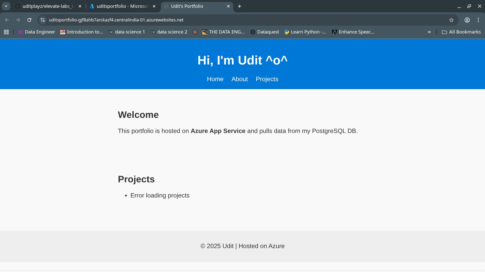

## Screenshots
- **Homepage (with live Azure URL visible)**  
  

- **Azure App Service Overview**  
  

## Deliverables
- **Live site URL:**  
  [https://uditsportfolio-gjf8ahb7arckazf4.centralindia-01.azurewebsites.net/](https://uditsportfolio-gjf8ahb7arckazf4.centralindia-01.azurewebsites.net/)  

- **Source code repository:**  
  [https://github.com/uditplayz/Elevate-labs_UJ_Task6/](https://github.com/uditplayz/Elevate-labs_UJ_Task6/)  

- **Screenshots:** Attached above  

## 📝 Short Note
This project is a **portfolio website** built with **HTML, CSS, and Node.js (Express)**, hosted on **Azure App Service**. It is designed to fetch and display project data from a **PostgreSQL database**.  

The site structure includes:
- **Homepage (index.html):** Introduction and dynamic Projects section  
- **About page (about.html):** Short personal profile  
- **Backend (server.js):** Express server with `/api/projects` endpoint  
- **Database (PostgreSQL):** Table `students` intended to store project details  

---

## 🔮 Future Improvements
- **Fix SQL integration:** Currently, the PostgreSQL connection is not fully functional due to authentication issues. Future work will involve verifying the correct admin username, firewall rules, and SSL settings.  
- Add more project details (descriptions, links, images).  
- Improve styling with a modern CSS framework.  